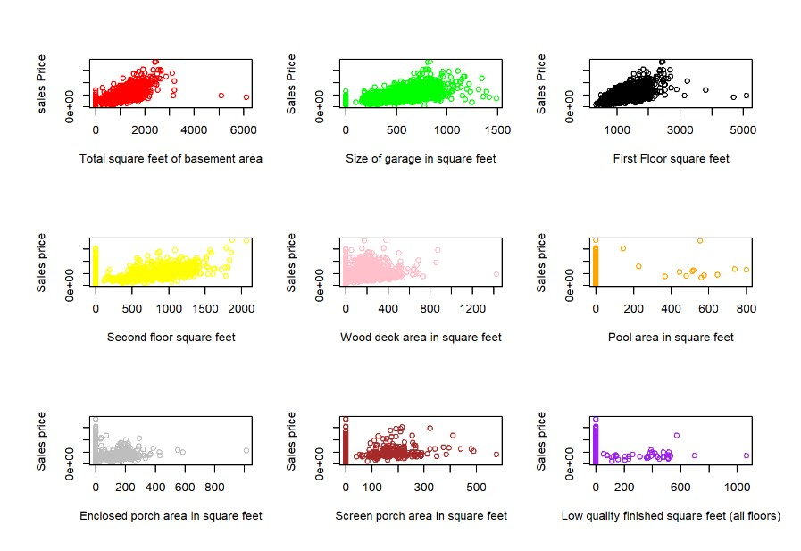
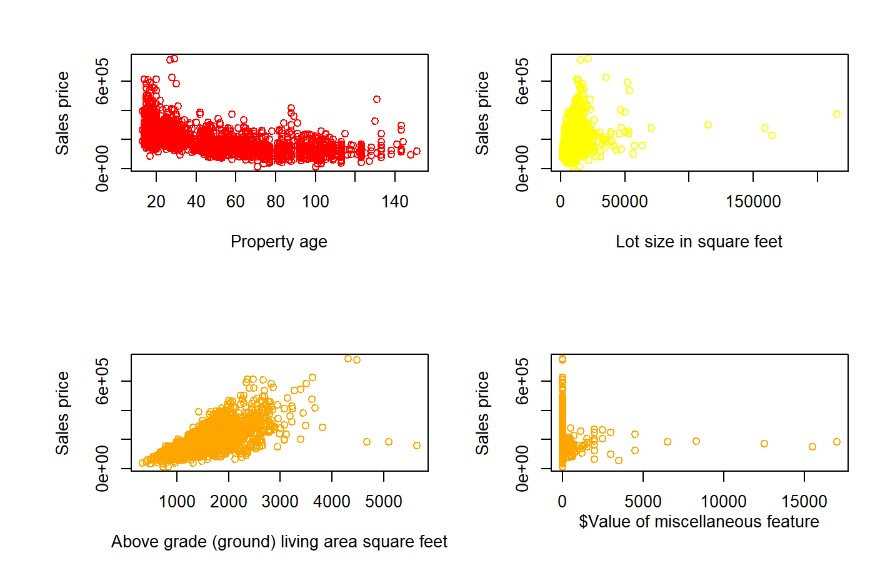
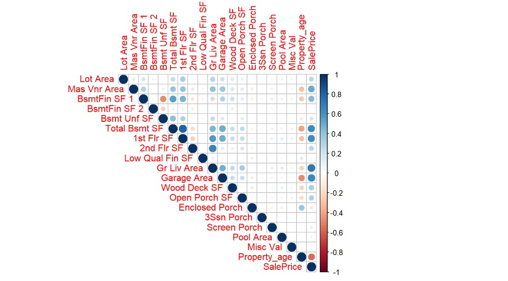
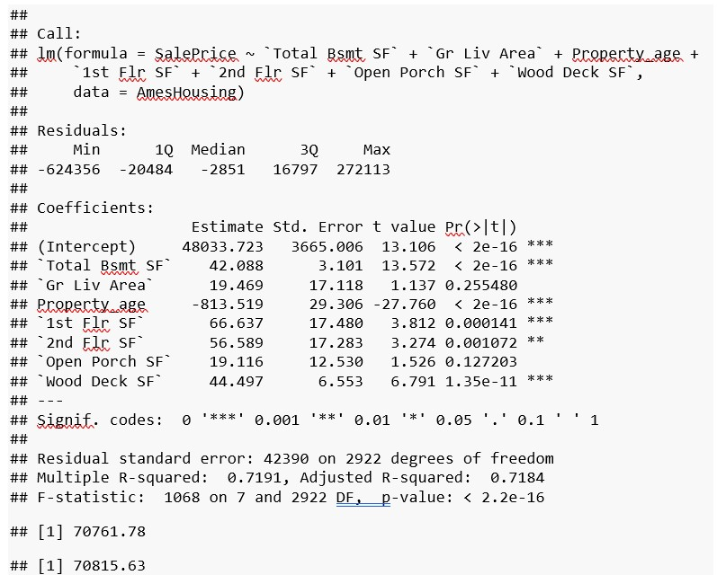
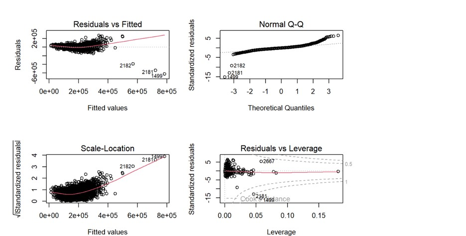
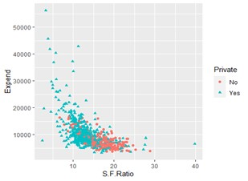

# [Regression Diagnostic with R](https://github.com/sana1410/R-Projects/blob/main/Sana_module1_19042023-1.Rmd)
## INTRODUCTION: - 
In this project we are going to fit, interpret and evaluate linear regression model on “AmesHousing” dataset. We are also going to implement diagnostic techniques to identify and correct issues with the model. We are also going to test that our model is following the assumption of linear regression.
## LINEAR REGRESION MODEL: -
Linear regression is a predictive analysis method used to model the relationship between a dependent variable and one or more independent variables. The basic idea behind linear regression is to find the best-fit straight line that determines the relationship between the variables.
A linear regression model can be written as 
### `Y=βo+β1X1+β2X2+β3X3+…….βNXN +ε`
where Y=target variable
X1, X2,X3….XN:-Predictor variables 
β0 is intercept, β1,β2,β3….βN are coefficients and ε<- it is the error
  
## ORDINARY LEAST SQUARE METHOD:-
The Ordinary Least Squares (OLS) method is a commonly used technique in linear regression analysis. It is used to estimate the parameters (coefficients) like β0,β1 of a linear regression model that minimizes the sum of the squared differences between the predicted value and actual values of the target variable.
### `Residuals ε=Y(Observed)-Y(Predicted`

### ASSUMPTIONS OF LINEAR REGRESSION: -
### 1.Linearity of the data: - 
The linear relationship between the predictor and the target (y) .We have assumed that there is a linear relationship between our target variables and predictor variables . This means that change in independent variable should be proportional to dependent variable.
### 2.Normality of residuals:- 
The residuals should be distributed normally. This means that distribution should follow the bell curve.
### 3.Homogeneity of residuals variance:- 
The residuals should have a constant variance.
### 4.No Multicollinearity: - 
The predictor variables should be independent of each other .
## Exploratory Data Analysis

## Correlation Matrix

## Model Building 

## Diagnostic Plots

# 
## INTRODUCTION :-
## Generalised Linear Models :-
Generalised liner modeling technique is the generalisation of linear regression predictive model to various non linear distribution.For GLM we do not need our target variable to be normally distributed. The target variable can be binary or even counts.
GLM is advanced modelling technique and is applied when the relationship between predictor and target variable is non linear . 
The various types of GLM are :-
1.	Logistic Regression-used when target variable is 0 or 1
2.	Possion Regresion-used when target variable is counts or frequency
3.	Linear Regression-for normally distributed target variable
There are 3 componenets of GLM 
### 1.	Random component :- 
the target variable distribution
### 2.	System component :- 
the linear combination of predictor variables 
### 3.	Link Functions :- 
function that specifies the link between random and systematic components
## LOGISTIC REGRESSION :-
Logistic Regression is a type of genaralised linear model in which the target variable is binary or categorical variable expressed in form of either 0 or 1 . It can be treated as classification model.
In logistic regression we predict the probabilities of occurance of target variable based on given set of predictor variables . The relationship between predictor variables and probabilities is non linear and ranges between 0 and 1 .
 
Hence the link function used in logistics regression is logit or probit function which gives the outcome in form of 0 or 1 .

 
## OBJECTIVE:-
The objective of this project is use college dataset having list of public and private US colleges from the 1995 with various measures like no of appication , enrollment and acceptance rate , tution fees and no of graduates etc .
1. We need to build a logistic regression model to predict whether a college with given set of measures is public/private .The target variable is binary with 2 level that is “yes /No”.
2. After model Creation we need to test the model with test data and check the model accuracy .
### Exploratory Data Analysis
### Boxplots

### Density Plots

### Scatterplots

## Correlation Matrix

## Model on Train Data

## ROC Curve

## Model on Test data

## ROC curve

